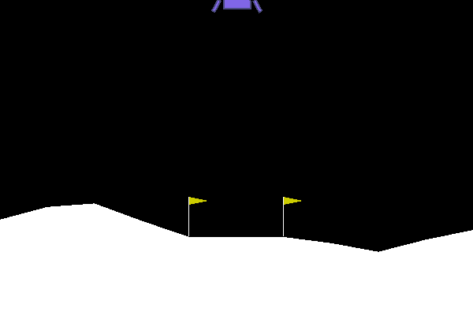
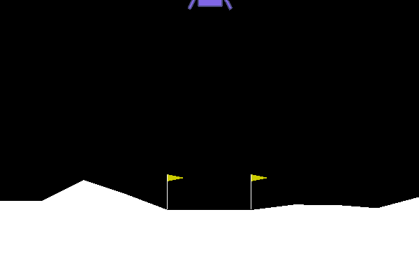
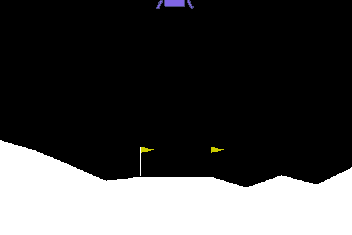
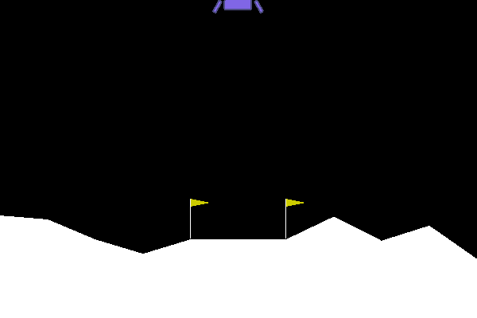

# Lunar Lander DRL

## Environment

## Reinforcement Learning Approaches
- ### Discrete space - Traditional RL methods like MC, TD
- ### Continuous Space
    - #### Discritize the space
        - Grid
        - Tile Coding
        - Coarse Coding
    - #### Continuous Function Approximation
        - Linear Approximation
        - kernel Approximation
        - Non-Linear Approximation

## Non-Linear Approximation
### Deep Q Network - [Paper](https://storage.googleapis.com/deepmind-media/dqn/DQNNaturePaper.pdf) 

### Double Deep Q Network - [Paper](https://arxiv.org/abs/1509.06461)

### Prioritized Experience Replay - [Paper](https://arxiv.org/abs/1511.05952)

### Dueling Deep Q Network - [Paper](https://arxiv.org/abs/1511.06581)
